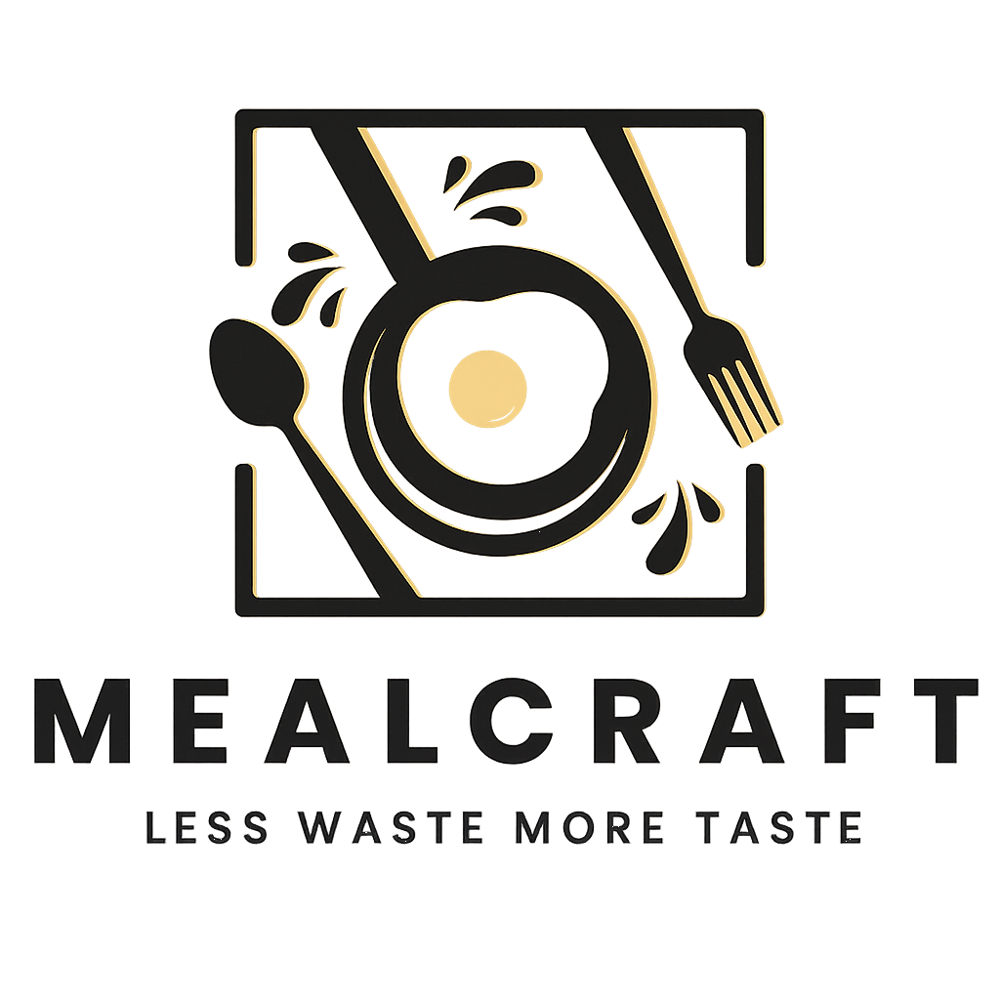


**MealCraft** is a smart, AI-enhanced recipe discovery platform that allows users to find delicious recipes based on the ingredients they have at hand. It combines user-friendly navigation, personalized recipe suggestions, and advanced filtering to make meal planning simple, efficient, and enjoyable.  

---

## Table of Contents
1. [Purpose](#purpose)  
2. [Features](#features)  
3. [Tech Stack](#tech-stack)  
4. [Pages Overview](#pages-overview)  
   - [Index/Landing Page](#indexlanding-page)  
   - [Search Page](#search-page)  
   - [Results Page](#results-page)  
   - [Recipe Page](#recipe-page)  
   - [Saved Recipes Page](#saved-recipes-page)  
   - [Profile Page](#profile-page)  
5. [Screenshots](#screenshots)  
6. [Getting Started](#getting-started)  
7. [Usage](#usage)  
8. [Future Enhancements](#future-enhancements)  
9. [License](#license)  

---

## Purpose
MealCraft aims to simplify meal planning by helping users:  
- Discover recipes based on available ingredients.  
- Save favorite recipes for easy access later.  
- Personalize recipe recommendations based on dietary preferences.  
- Explore new culinary ideas with minimal effort.  

MealCraft is perfect for busy individuals, students, or anyone looking to make cooking fun and efficient.  

---

## Features
- Dynamic ingredient selection with smart filtering.  
- Personalized recipe recommendations stored in **localStorage**.  
- Save and manage favorite recipes.  
- User profile management (name, avatar, preferences).  
- Clean and responsive interface with light/dark mode support.  
- AI-powered recipe suggestions via Spoonacular API integration.  

---

## Tech Stack
- **Frontend:** HTML, CSS, JavaScript, Tailwind CSS  
- **API Integration:** Spoonacular API for recipe data  
- **Data Storage:** localStorage for saved recipes and preferences  
- **Hosting:** GitHub Pages (for deployment)  

---

## Pages Overview

### Index / Landing Page
- Entry point for MealCraft.  
- Features:
  - Welcome message and tagline.
  - Login and Sign-Up buttons.
  - Eye-catching hero section with imagery.  
- Encourages users to start their recipe discovery journey.  

**Screenshot:**  
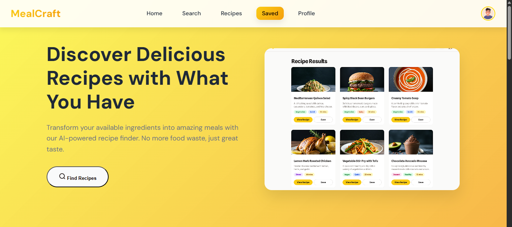

---

### Search Page
- Users can input ingredients they have on hand.  
- Features:
  - Multi-select ingredient chips with dynamic suggestions.  
  - Clear All button to reset selections.  
  - Instant updates of saved preferences.  
- Filters recipes dynamically based on selected ingredients.  

**Screenshot:**  
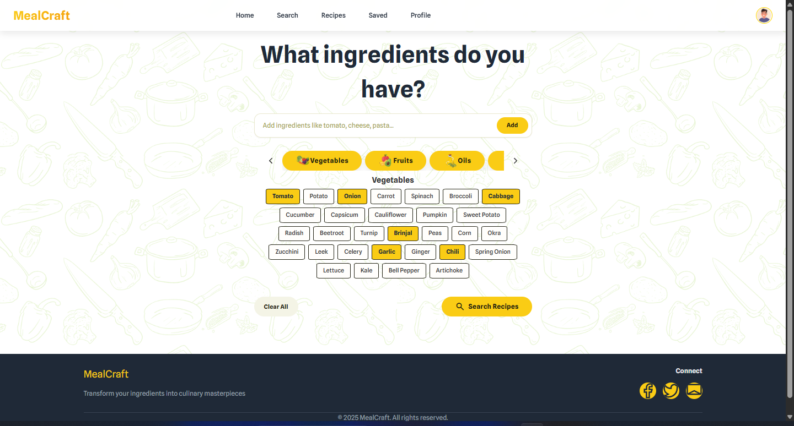

---

### Results Page
- Displays recipes matching selected ingredients and preferences.  
- Features:
  - Recipe cards with image, title, and key info.  
  - Filters for dietary preferences (vegan, vegetarian, gluten-free, etc.).  
  - Pagination or scrollable results for large lists.  
- Integrates with localStorage to highlight already saved recipes.  

**Screenshot:**  
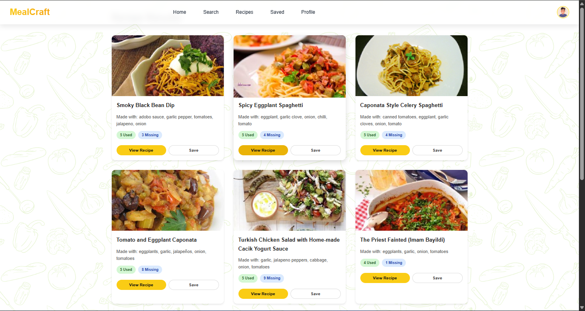

---

### Recipe Page
- Detailed view of a single recipe.  
- Features:
  - Ingredients list with quantities.  
  - Step-by-step cooking instructions.  
  - Option to save recipe to localStorage.  
  - Nutritional info and preparation time.  

**Screenshot:**  
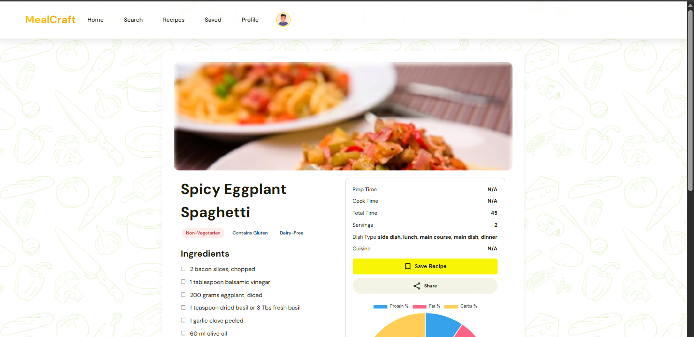
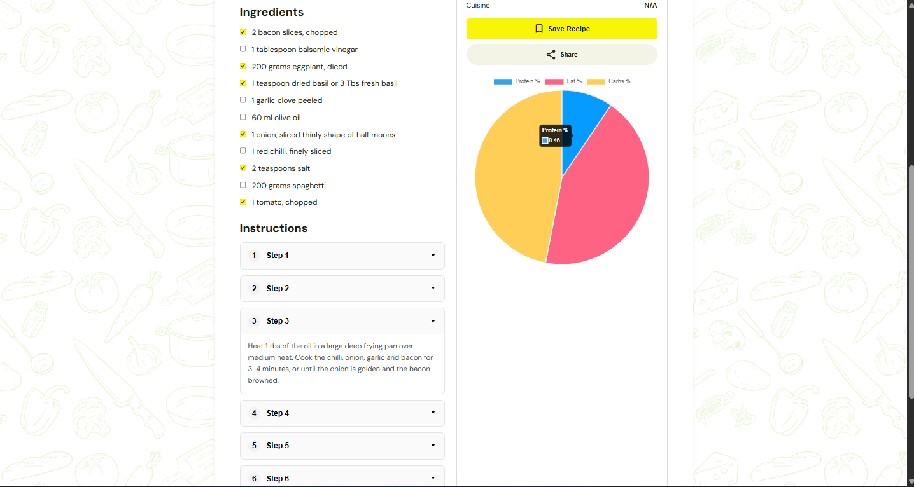
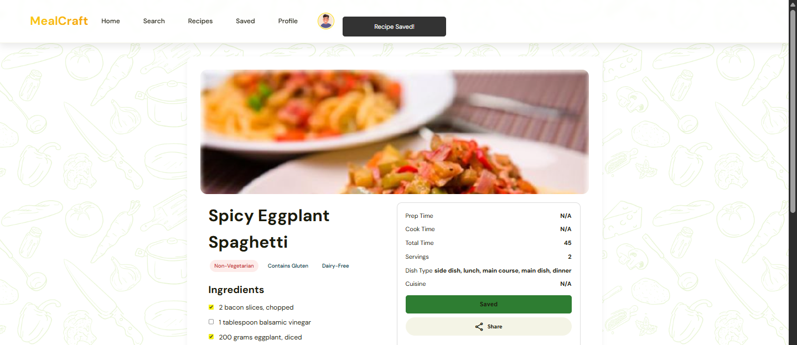

---

### Saved Recipes Page
- Central hub for all favorite recipes.  
- Features:
  - List of saved recipes with images and titles.  
  - Option to remove recipes from saved list.  
  - Persistence via localStorage even after browser refresh.  

**Screenshot:**  
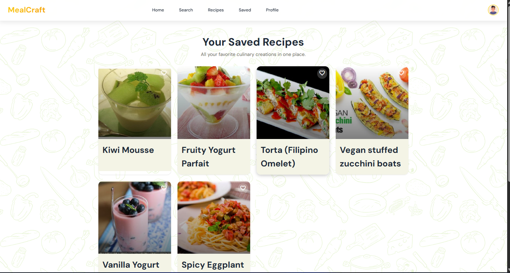


---

### Profile Page
- Allows users to customize their account and preferences.  
- Features:
  - Edit profile name and avatar.  
  - Update dietary preferences for personalized recipe recommendations.  
  - Save changes persistently in localStorage.  

**Screenshot:**  
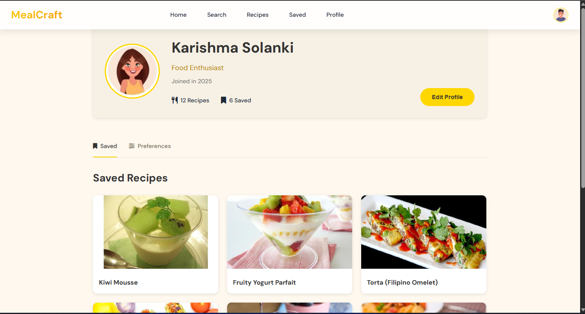
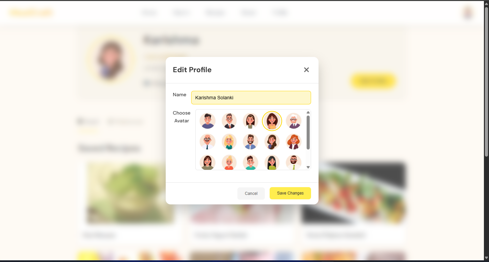
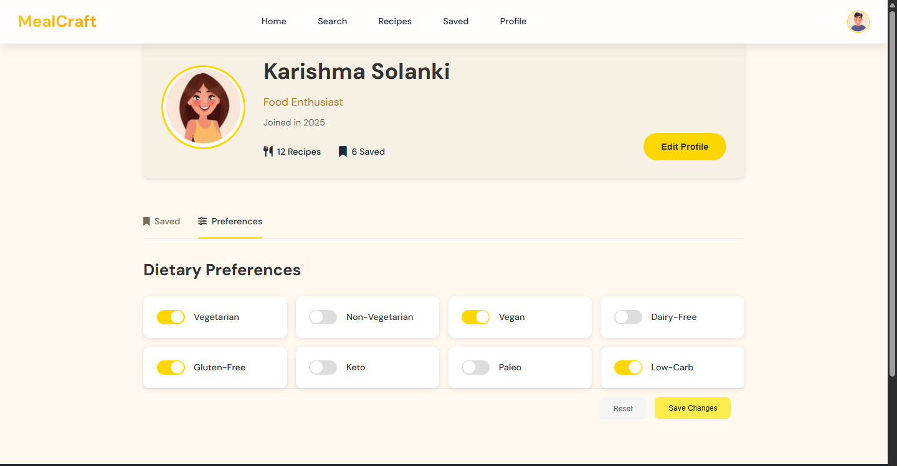

---

## Screenshots
All screenshots are stored in the `/assets/ss` folder. They showcase the interface and user interactions for easy understanding.  

---

## Getting Started

1. Clone the repository:
```bash
git clone https://github.com/yourusername/MealCraft.git
```

2. Navigate into the project directory:
```bash
cd MealCraft
```

3. Open `index.html` in your browser to start using MealCraft:
```bash
# On Windows
start index.html

# On Mac
open index.html

# On Linux
xdg-open index.html
```

4. (Optional) Deploy via GitHub Pages:
- Push your repository to GitHub.
- Go to your repository Settings → Pages → Select branch `main` or `master` → Save.
- Access your live site at `https://yourusername.github.io/MealCraft/`.

